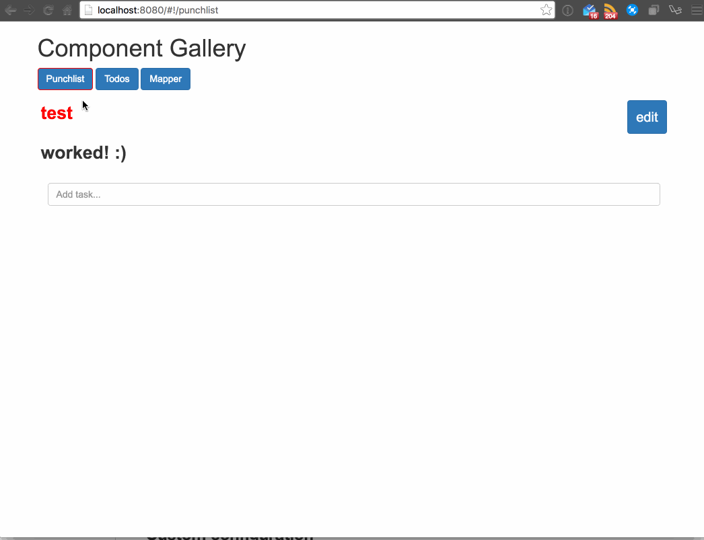

# component-gallery

An implementation of vue-router to show the knitting together of various components.



## A note on the status

I built this for a Meetup presentation a day or so before the presentation. Some of the parts don't work (the PlaceMapper is not implemented because google maps collides with the mapper, the jquery usage in the mapper component isn't working at the moment and in retrospect I would implement it differently (sans jquery) anyway) and I'm probably not going to circle back to fix them because they're ancillary to the point of the presentation. 

On the same note, each of the components here were built as a learning/exploration exercise as I explored javascript build tools, vue.js, vue plugins, and google maps so these builds of the components probably aren't the best anyway and merit refactors. 

All of that said, feel free to explore, but know it's not and likely will never be the best implementation of these tools and concepts ;)

## Components included
Each of the components in this gallery are from separate projects. I brought them together here to show off vue-router and to elaborate on the concept of modular components and how easy it is to move them around (between projects) and knit them together.

The components included here are:

- [Punchlist](https://github.com/chris-schmitz/Punchlist)
- [VueToDos](https://github.com/chris-schmitz/VueToDos)
- [Mapper](https://github.com/chris-schmitz/Mapper)

The [PlaceMapper2](https://github.com/chris-schmitz/PlaceMapper2) project is also included within the components directory but it has not been hooked into the gallery; when placemapper is included there is some conflict between its google map and the mapper's google map. 


## Build Setup

``` bash
# install dependencies
npm install

# serve with hot reload at localhost:8080
npm run dev

```
